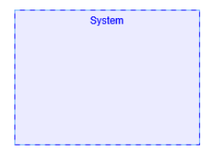
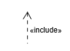
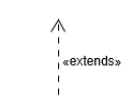
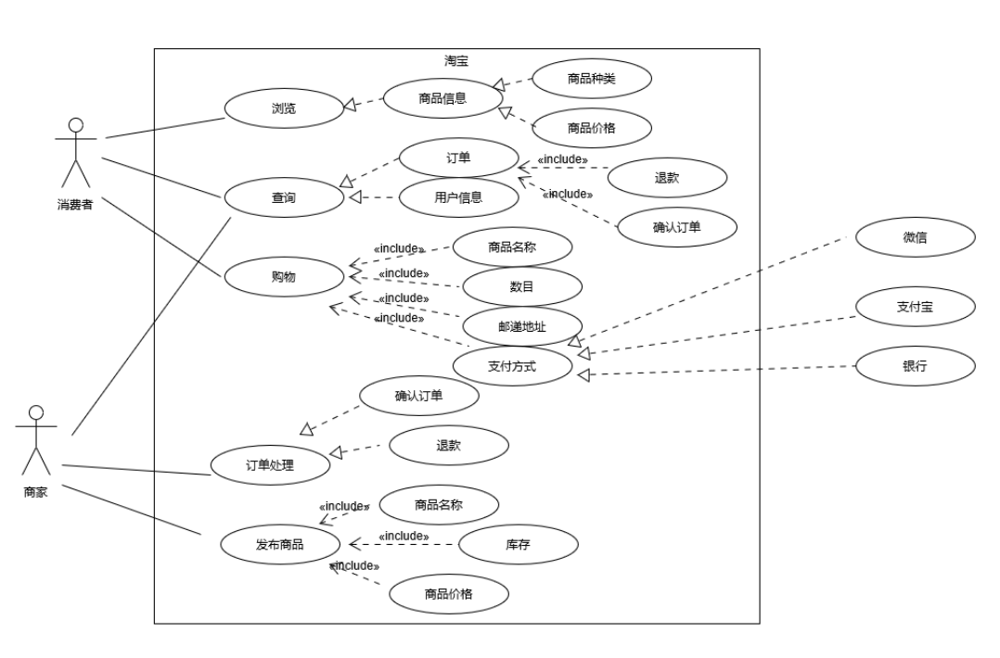

# 用例建模 - 绘制用例图
16340180  
彭仕扬  

---

# 一、简答

---

#### 1.用例  
&emsp;用例是软件工程或系统工程中对系统如何反应外界请求的描述，是一种通过用户的使用场景来获取需求的技术。  

---

#### 2.用例和场景的关系；什么是主场景或happy path
用例和场景的关系：每个用例提供了一个或多个场景，该场景说明了系统是如何和最终用户或其它系统互动，也就是谁可以用系统做什么，从而获得一个明确的业务目标。  
  
主场景：是场景中最主要的交互，一般是经常出现的，用户最常用的场景流程。  

---

#### 3.用例的形式
Brief(高级层次)：通常是一段简短的主要成功场景的总结，在早期分析需求的过程中，帮助用户快速了解主题和范围。  

Casual(简便模式)：非正式段落格式，覆盖多个场景的多个段落。 
 
Fully:用例的所有步骤和变化都有详细的描述。  

---

#### 4.对于复杂业务，为什么编制完整用例非常难
对于复杂业务的场景非常复杂，用例建模很难从一开始就照顾到全部细节。而且复杂的用例模型也十分复杂，可读性不佳。  

---

#### 5.用例图
用例图是指由参与者、用例，边界以及它们之间的关系构成的用于描述系统功能的视图。

---

#### 6.用例图的基本符号与元素
参与者：系统中的用户，即与系统交互的对象  
;  
用例：用户与系统的交互行为  
;  
系统边界：表示正在建模系统的边界。边界内表示系统的组成部分，边界外表示系统外部。  
)  
包含关系：发起用例为被指向的用例的行为之一  
  
扩展关系：发起用例为指向的用例的功能扩展  
  
泛化关系：发起用例是被指向的用例的特例之一  
  
关联关系：表示参与者与用例之间的关系  

---

#### 7.用例图的画法与步骤

1.分析需求、标定范围(系统边界)  
2.确认参与者
3.确认用例
4.完善参与者与用例、用例于用例之间的关系

---

#### 8.用例图给利益相关人与开发者的价值
用例图可以帮助用户快速了解系统的主要功能，与交互关系。可以形象地描述一个系统中各个用例、参与者之间的关系。开发者可以通过用例图一目了然的了解需要开发的系统功能概括。

---

# 二、用例模型用例
  
1.为什么相似系统的用例图是相似的:  
&emsp;因为相似系统的功能，用例，参与者，用例和用例之间的关系，参与者与用例之间的关系也是相似的。因此所构成的用例图也是相似的。  
2.如何利用不同时代、不同地区产品的用例图，展现、突出创新业务和技术:  
&emsp;使用不同的颜色标记。  
3.如何利用用例图定位创新思路（业务创新、或技术创新、或商业模式创新）在系统中的作用  
&emsp;使用不同颜色标记。  
4.使用SCRUM方法，选择一个用例图，编制某定旅馆开发的需求（backlog）开发计划表：  

| ID | name | Est | Iter | Imp | how to demo |
|:-:|:-:|:-:|:-:|:-:|:-:|
| 1  | find hotel  | 2  | 1  | 5  | search with hotel name |
| 2  | find city  | 2  | 3  | 5  | find hotels in the city with GPS API |
| 3  | pay | 5  | 1  | 2  | get a pay API (such as Alipay) |
| 4  | order query  | 3  | 3  | 2  | find the history order |

